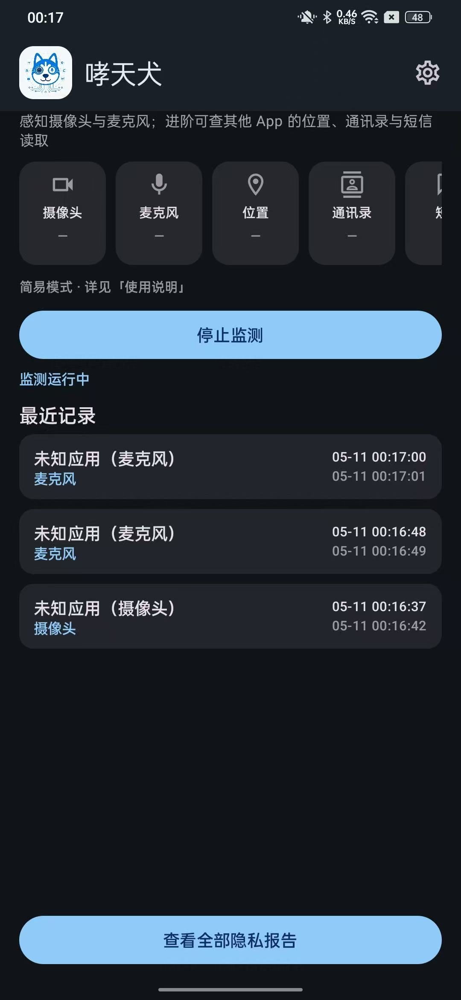
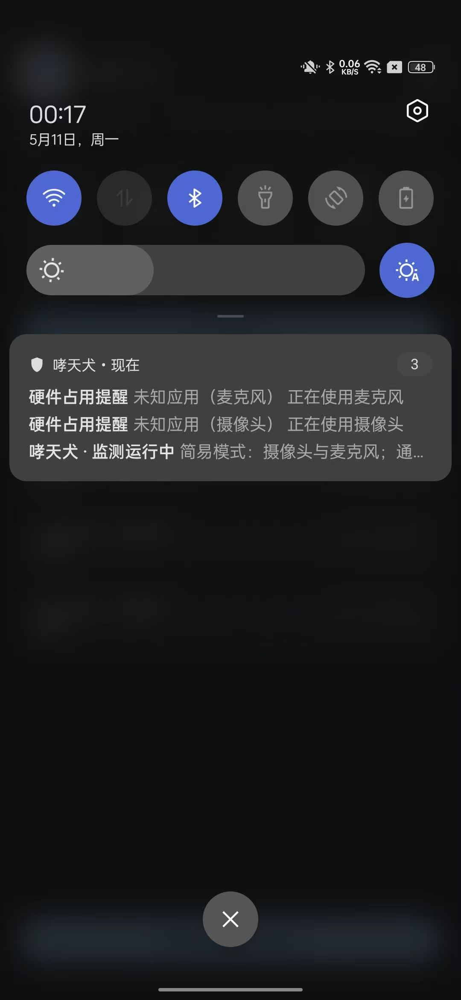
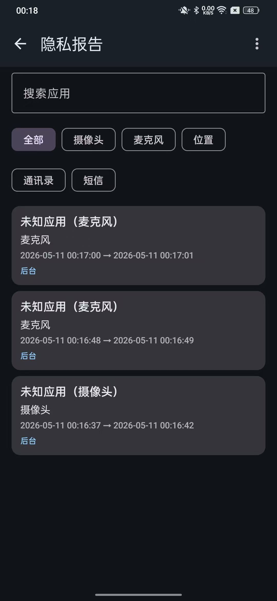

# PrivacyHound (哮天犬) 

**PrivacyHound (哮天犬)** 是一款由 **HackingGroup** 出品的专为 Android 用户设计的隐私监控利器。它如同其名，像神话中的哮天犬一样敏锐，能够实时捕捉并记录手机中各种 App 对敏感权限的调用行为。

**PrivacyHound** is a privacy monitoring tool designed for Android users, developed by **HackingGroup**. Just like its namesake (the legendary hound), it keeps a sharp eye on your device, capturing and recording sensitive permission usage by various apps in real-time.

---

## 🌐 关于 HackingGroup | About HackingGroup

**HackingGroup** 致力于推动网络安全与隐私保护技术的发展。我们相信技术的力量可以更好地守护个人隐私。

**HackingGroup** is dedicated to advancing cybersecurity and privacy protection technologies. We believe in the power of technology to better safeguard personal privacy.

- **官方网站 (CN)**: [https://hackinggroup.org.cn](https://hackinggroup.org.cn)
- **Official Website (EN)**: [https://hackinggroup.org](https://hackinggroup.org)

---

## ✨ 核心功能 | Features

- **实时监控 (Real-time Monitoring)**: 实时检测摄像头、麦克风、地理位置（GPS）等硬件的开启状态。
- **敏感数据追踪 (Sensitive Data Tracking)**: 记录 App 对联系人读取、短信读取等敏感数据的访问行为。
- **隐私看板 (Privacy Dashboard)**: 直观展示当前正在使用敏感权限的 App 及其占用的传感器。
- **历史回溯 (Usage History)**: 详细记录每一次权限调用的开始时间、持续时长及调用方 App，让偷窥行为无所遁形。
- **精准识别 (Precise Identification)**: 利用 Android AppOps 统计技术，精准匹配权限使用记录。

---

## 🛠️ 技术栈 | Tech Stack

- **语言**: Kotlin
- **UI 框架**: Jetpack Compose (Material 3)
- **架构**: MVVM + Clean Architecture (Repository Pattern)
- **异步处理**: Kotlin Coroutines & Flow
- **数据存储**: Room Database
- **核心组件**: Android Service, AppOpsManager, Accessibility Service (if applicable)

---

## 📸 运行截图 | Screenshots

  
  
  

---

## 🚀 快速上手 | Getting Started

### 环境要求
- Android Studio Ladybug | 2024.2.1 或更高版本
- JDK 17+
- Android 8.0 (API 26) +

### 编译运行
1. 克隆仓库: `git clone https://github.com/your-username/PrivacyHound.git`
2. 使用 Android Studio 打开项目。
3. 等待 Gradle 同步完成。
4. 连接 Android 设备，点击 **Run**。

---

## 🛡️ 隐私声明 | Privacy

**单机版安全保证**: PrivacyHound 本身为**单机应用**，不具备联网功能，**不会**上传您的任何个人数据。所有的权限监控日志均保存在您手机本地的 Room 数据库中。本软件完全开源，欢迎查阅源码进行审计。

**Standalone Security**: PrivacyHound is a **standalone application** with no network access permissions. It **does not** upload any of your personal data. All monitoring logs are stored locally on your device in a Room database. This software is fully open-source, and you are welcome to audit the source code.

---

## ⚠️ 免责声明 | Disclaimer

本软件仅供安全技术研究与学习之用。请在合法合规的前提下使用。

This software is for security research and educational purposes only. Please use it in compliance with local laws and regulations.

---

## 🤝 贡献指南 | Contributing

欢迎任何形式的 Contribution！
- 提交 Issue 报告 Bug。
- 提交 Pull Request 改进代码或新增功能。
- 完善文档或翻译。

---

## 📄 开源协议 | License

本项目采用 [Apache License 2.0](LICENSE) 协议开源。

Copyright (c) 2024 HackingGroup.
